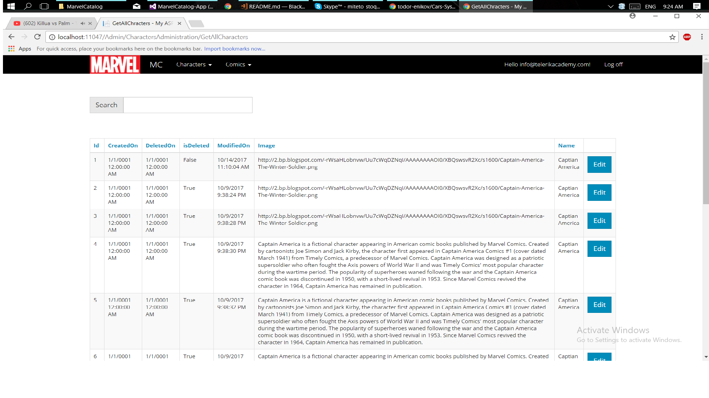
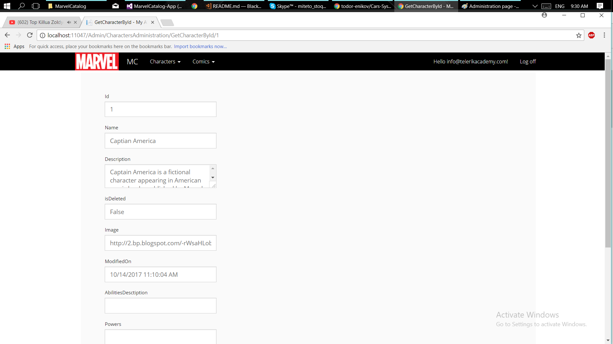
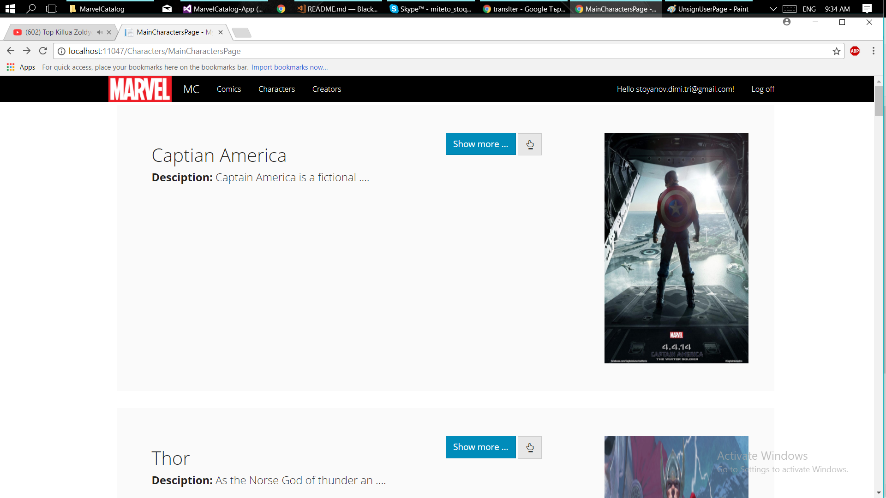
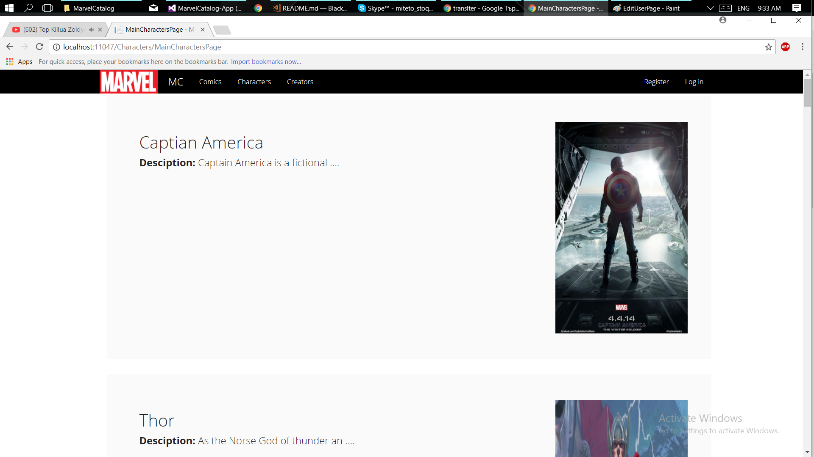

# MarvelCatalog
Final project for Telerik Academy 2016-2017 season

### Link to Telerik Academy:
* telerik2014 - Димитър Стоянов - https://telerikacademy.com/Users/telerik2014

### Project desctiption:
This is application made on ASP .NET MVC. It's purpose is to collect information about comics and their characters. The application has administration panel and reqular user. The administrator can add, remove and modify characters ans comics. The specific in this application is that the administrator of the application can filter characters or comics and then show them to the administrator.

Roles in the application and what can they visit.
* Admin - can visit all pages in the application.
* Regular user - can visit characters, comics, creators, profile pages.
* Not registered user - can see only  characters, comics, creators pages with fewer information and login pages.

### Images from the application:

